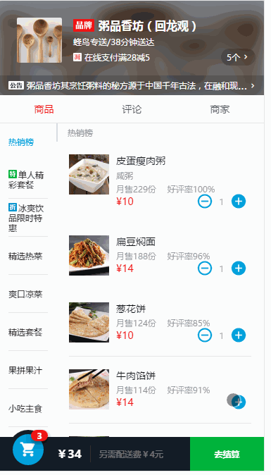

# elm(饿了么移动端单页应用)

> 这是一个基于Vue2.0实现的饿了么移动端webapp

> 项目地址：[elm](https://github.com/MaxWang510/elm)

> 如果觉得对您有帮助，您可以在右上角给我个star支持一下，谢谢！

##  项目运行截图



##  项目运行

```bash
# 克隆项目到本地
git clone https://github.com/MaxWang510/elm.git

#  安装依赖
npm install

# 本地开发
npm run dev

#  打包
npm run build

```

##  项目说明

> 用到的技术栈

vue2.0 + vue-router + webpack + vue-cli + axios + stylus + flex


